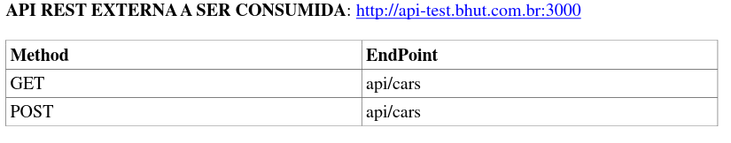
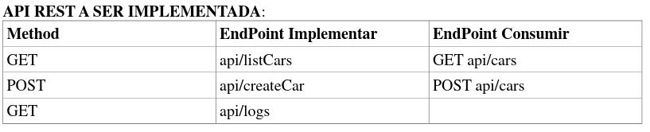
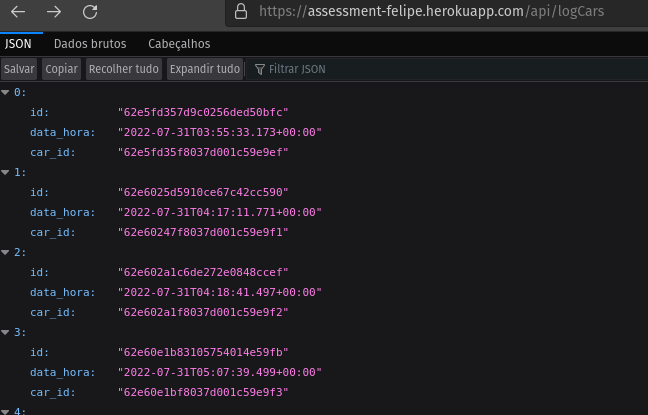
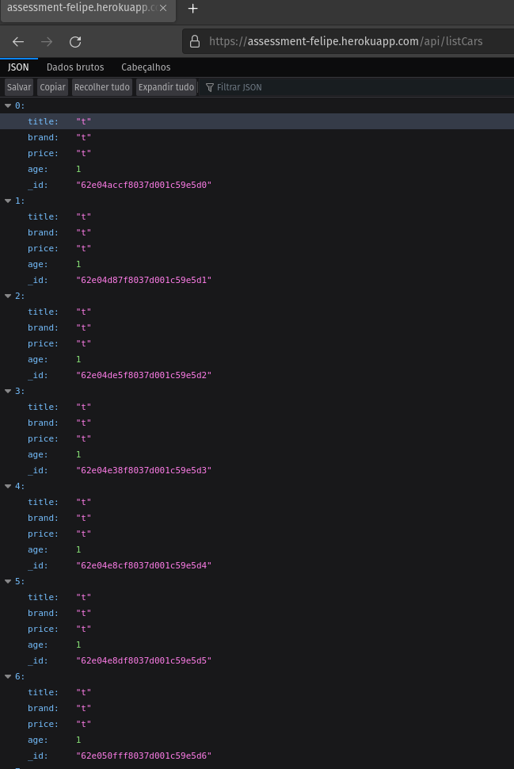
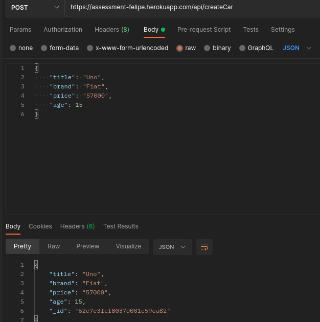

<h1 align="center">
    API Rest
</h1>

<h4 align="center">
    Utilizando Java juntamente com Framework Spring Boot, foi realizado o desenvolvimento de uma API Rest
</h4>

    
    
    
    
    
    

## :information_source: Informações do projeto

Esse projeto foi utilizado com as seguintes tecnologias:

- Framework Spring Boot 2.7.2;
- Maven;
- Linguagem Java 11;
- IDE Intellij;
- Banco NoSQL MongoDB;
- Heroku Cli App.

Para conseguir rodar e ver os resultados, pode ser baixado o ZIP e buildado localmente, ou utilizando o link gerado do heroku, que permite realizar as mesmas funções.
 
Sendo então:

- [Get list cars](https://assessment-felipe.herokuapp.com/api/listCars)
- [Post creat car](https://assessment-felipe.herokuapp.com/api/createCar)
- [Get log create car](https://assessment-felipe.herokuapp.com/api/logCars)

## :computer: Resultados

<h6 align="center">Log de registro quando um carro é inserido </h6>

<h6 align="center">Lista todos os carros consultando na apiExterna </h6>

<h6 align="center">Post, criação de um carro dentro da API</h6>

---
Feito por Felipe Abreu :wave: [Venha me conhecer um pouco mais!](https://www.linkedin.com/in/felipe-abreu)
